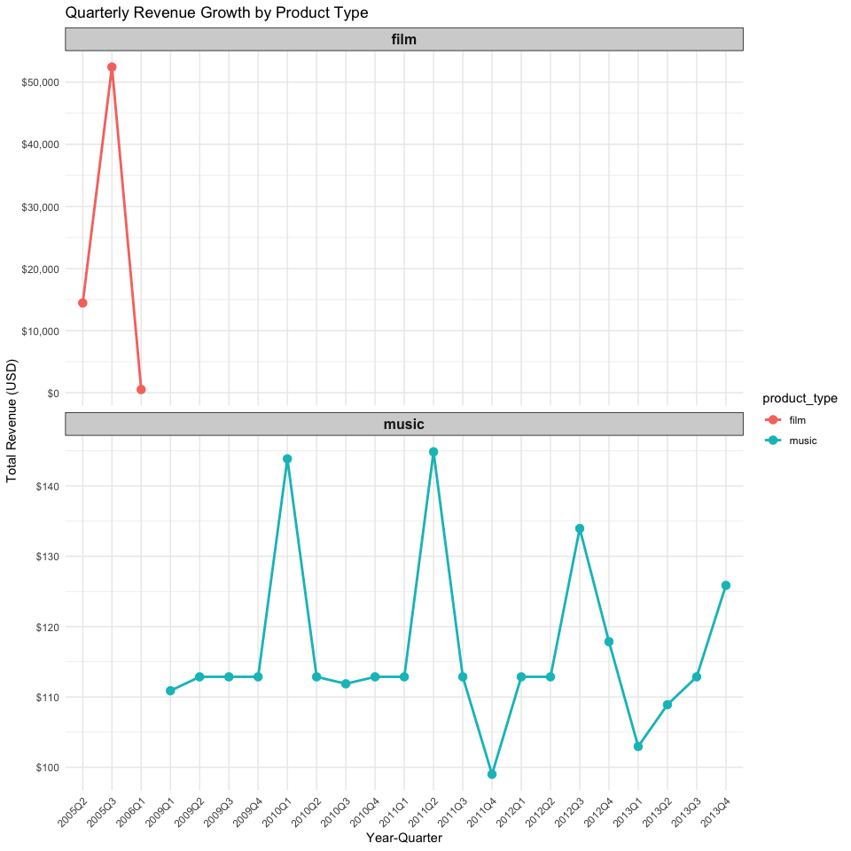

# Background

Media Distributors, Inc. is a Wichita, KY based distributor and seller of films and music for commercial purposes. For the past few years, it has managed its film and music sales separately using different applications. This division is historical as Media Distributors started distributing films and then acquired SoundMania about two years ago. As the two distribution channels were different, CTO Alvin Coelho made the decision not to integrate the SoundMania’s information systems and database with those of Media Distributors. This has not been a problem until now, however Media Distributors intends to make itself available for acquisition. To that end, an integrated view of the business, particularly sales, is needed.

This report provides key sales, revenue, and customer metrics to showcase Media Distributors business. The analysis provided is based on data from a custom-built datamart containing data extracted from two operational databases.

# Key Business Metrics
This sections provides key revenue and customer information segmented by time, country, and business unit. Revenue numbers are in US$.

## Sales Revenue
The year with the most sales was 2005 with a total revenue across both business units of $66,892.38. The country with the highest sales in 2013 was USA with total revenue across both business units of $85.14. It was followed by Canada with $72.27.

<table class="table table-striped table-hover" style="color: black; width: auto !important; margin-left: auto; margin-right: auto;">
<caption>Top 5 Countries by Total Revenue (Film + Music) Across Years</caption>
 <thead>
  <tr>
   <th style="text-align:left;"> Country </th>
   <th style="text-align:right;"> 2012 </th>
   <th style="text-align:right;"> 2013 </th>
   <th style="text-align:right;"> Total </th>
  </tr>
 </thead>
<tbody>
  <tr>
   <td style="text-align:left;"> USA </td>
   <td style="text-align:right;"> 127.98 </td>
   <td style="text-align:right;"> 85.14 </td>
   <td style="text-align:right;"> 213.12 </td>
  </tr>
  <tr>
   <td style="text-align:left;"> Canada </td>
   <td style="text-align:right;"> 42.57 </td>
   <td style="text-align:right;"> 72.27 </td>
   <td style="text-align:right;"> 114.84 </td>
  </tr>
  <tr>
   <td style="text-align:left;"> Brazil </td>
   <td style="text-align:right;"> 53.46 </td>
   <td style="text-align:right;"> 37.62 </td>
   <td style="text-align:right;"> 91.08 </td>
  </tr>
  <tr>
   <td style="text-align:left;"> France </td>
   <td style="text-align:right;"> 36.66 </td>
   <td style="text-align:right;"> 40.59 </td>
   <td style="text-align:right;"> 77.25 </td>
  </tr>
  <tr>
   <td style="text-align:left;"> Czech Republic </td>
   <td style="text-align:right;"> 19.83 </td>
   <td style="text-align:right;"> 36.75 </td>
   <td style="text-align:right;"> 56.58 </td>
  </tr>
</tbody>
</table>
The table below shows the revenue broken down by quarter for the top five countries. It shows the total revenue for each quarter across all business units and years. So, for example, the column “Q1” is the total sales for music and film for all years for which there is data, which is from 2005 to 2013.

<table class="table table-striped table-hover" style="color: black; width: auto !important; margin-left: auto; margin-right: auto;">
<caption>Top 5 Countries by Total Revenue (Film + Music) Across All Quarters</caption>
 <thead>
  <tr>
   <th style="text-align:left;"> Country </th>
   <th style="text-align:right;"> Q1 </th>
   <th style="text-align:right;"> Q2 </th>
   <th style="text-align:right;"> Q3 </th>
   <th style="text-align:right;"> Q4 </th>
   <th style="text-align:left;"> Average </th>
  </tr>
 </thead>
<tbody>
  <tr>
   <td style="text-align:left;"> India </td>
   <td style="text-align:right;"> 77.63 </td>
   <td style="text-align:right;"> 1,283.60 </td>
   <td style="text-align:right;"> 5,338.34 </td>
   <td style="text-align:right;"> 3.97 </td>
   <td style="text-align:left;"> 1675.88 </td>
  </tr>
  <tr>
   <td style="text-align:left;"> China </td>
   <td style="text-align:right;"> 40.87 </td>
   <td style="text-align:right;"> 1,294.93 </td>
   <td style="text-align:right;"> 4,462.94 </td>
   <td style="text-align:right;"> 0.00 </td>
   <td style="text-align:left;"> 1449.68 </td>
  </tr>
  <tr>
   <td style="text-align:left;"> USA </td>
   <td style="text-align:right;"> 125.93 </td>
   <td style="text-align:right;"> 1,035.46 </td>
   <td style="text-align:right;"> 3,344.28 </td>
   <td style="text-align:right;"> 127.71 </td>
   <td style="text-align:left;"> 1158.34 </td>
  </tr>
  <tr>
   <td style="text-align:left;"> Japan </td>
   <td style="text-align:right;"> 22.91 </td>
   <td style="text-align:right;"> 777.18 </td>
   <td style="text-align:right;"> 2,670.66 </td>
   <td style="text-align:right;"> 0.00 </td>
   <td style="text-align:left;"> 867.68 </td>
  </tr>
  <tr>
   <td style="text-align:left;"> Brazil </td>
   <td style="text-align:right;"> 52.65 </td>
   <td style="text-align:right;"> 701.01 </td>
   <td style="text-align:right;"> 2,568.65 </td>
   <td style="text-align:right;"> 68.31 </td>
   <td style="text-align:left;"> 847.65 </td>
  </tr>
</tbody>
</table>
## Customer Distribution
Across both business units, there are 1,734 customers in 114 different countries, with the majority of customers in USA, India, China.

<table class="table table-striped table-hover" style="color: black; width: auto !important; margin-left: auto; margin-right: auto;">
<caption>Top 5 Countries by Total Customer Count</caption>
 <thead>
  <tr>
   <th style="text-align:left;"> Country </th>
   <th style="text-align:right;"> film </th>
   <th style="text-align:right;"> music </th>
   <th style="text-align:right;"> Total </th>
  </tr>
 </thead>
<tbody>
  <tr>
   <td style="text-align:left;"> USA </td>
   <td style="text-align:right;"> 81 </td>
   <td style="text-align:right;"> 84 </td>
   <td style="text-align:right;"> 165 </td>
  </tr>
  <tr>
   <td style="text-align:left;"> India </td>
   <td style="text-align:right;"> 139 </td>
   <td style="text-align:right;"> 12 </td>
   <td style="text-align:right;"> 151 </td>
  </tr>
  <tr>
   <td style="text-align:left;"> China </td>
   <td style="text-align:right;"> 118 </td>
   <td style="text-align:right;"> 0 </td>
   <td style="text-align:right;"> 118 </td>
  </tr>
  <tr>
   <td style="text-align:left;"> Brazil </td>
   <td style="text-align:right;"> 61 </td>
   <td style="text-align:right;"> 31 </td>
   <td style="text-align:right;"> 92 </td>
  </tr>
  <tr>
   <td style="text-align:left;"> Japan </td>
   <td style="text-align:right;"> 69 </td>
   <td style="text-align:right;"> 0 </td>
   <td style="text-align:right;"> 69 </td>
  </tr>
</tbody>
</table>

## Film vs Music Revenue
Sales fluctuate over time and the table below shows total revenue per month for the years for which we have data.
<table class="table table-striped table-hover" style="color: black; width: auto !important; margin-left: auto; margin-right: auto;">
<caption>Film vs Music Revenue by Year</caption>
 <thead>
  <tr>
   <th style="text-align:left;"> Product Type </th>
   <th style="text-align:right;"> 2005 </th>
   <th style="text-align:right;"> 2006 </th>
   <th style="text-align:right;"> 2009 </th>
   <th style="text-align:right;"> 2010 </th>
   <th style="text-align:right;"> 2011 </th>
   <th style="text-align:right;"> 2012 </th>
   <th style="text-align:right;"> 2013 </th>
   <th style="text-align:right;"> Total </th>
  </tr>
 </thead>
<tbody>
  <tr>
   <td style="text-align:left;"> film </td>
   <td style="text-align:right;"> 66,892.38 </td>
   <td style="text-align:right;"> 514.18 </td>
   <td style="text-align:right;"> 0.00 </td>
   <td style="text-align:right;"> 0.00 </td>
   <td style="text-align:right;"> 0.00 </td>
   <td style="text-align:right;"> 0.00 </td>
   <td style="text-align:right;"> 0.00 </td>
   <td style="text-align:right;"> 67,406.56 </td>
  </tr>
  <tr>
   <td style="text-align:left;"> music </td>
   <td style="text-align:right;"> 0.00 </td>
   <td style="text-align:right;"> 0.00 </td>
   <td style="text-align:right;"> 449.46 </td>
   <td style="text-align:right;"> 481.45 </td>
   <td style="text-align:right;"> 469.58 </td>
   <td style="text-align:right;"> 477.53 </td>
   <td style="text-align:right;"> 450.58 </td>
   <td style="text-align:right;"> 2,328.60 </td>
  </tr>
</tbody>
</table>

The graph below illustrates the quarterly growth of the film and music business over the past years for which we have data.
<!-- -->
In terms of units sold, the table below sheds light on this by country and by business unit.

Number of units sold by country and business unit for past three years.
<table class="table table-striped table-hover" style="color: black; width: auto !important; margin-left: auto; margin-right: auto;">
<caption>Top 5 Countries by Total Revenue (Film + Music) by Year and Quarter</caption>
 <thead>
  <tr>
   <th style="text-align:left;"> Quarter </th>
   <th style="text-align:right;"> 2005 </th>
   <th style="text-align:right;"> 2006 </th>
   <th style="text-align:right;"> 2009 </th>
   <th style="text-align:right;"> 2010 </th>
   <th style="text-align:right;"> 2011 </th>
   <th style="text-align:right;"> 2012 </th>
   <th style="text-align:right;"> 2013 </th>
   <th style="text-align:right;"> Quarter Total </th>
   <th style="text-align:right;"> Quarter Average </th>
  </tr>
 </thead>
<tbody>
  <tr grouplength="6"><td colspan="10" style="border-bottom: 1px solid;"><strong>India</strong></td></tr>
<tr>
   <td style="text-align:left;padding-left: 2em;" indentlevel="1"> Q1 </td>
   <td style="text-align:right;"> 0.00 </td>
   <td style="text-align:right;"> 62.77 </td>
   <td style="text-align:right;"> 0.00 </td>
   <td style="text-align:right;"> 1.99 </td>
   <td style="text-align:right;"> 8.91 </td>
   <td style="text-align:right;"> 0.00 </td>
   <td style="text-align:right;"> 3.96 </td>
   <td style="text-align:right;"> 77.63 </td>
   <td style="text-align:right;"> 11.09 </td>
  </tr>
  <tr>
   <td style="text-align:left;padding-left: 2em;" indentlevel="1"> Q2 </td>
   <td style="text-align:right;"> 1,262.81 </td>
   <td style="text-align:right;"> 0.00 </td>
   <td style="text-align:right;"> 3.96 </td>
   <td style="text-align:right;"> 1.98 </td>
   <td style="text-align:right;"> 0.00 </td>
   <td style="text-align:right;"> 8.91 </td>
   <td style="text-align:right;"> 5.94 </td>
   <td style="text-align:right;"> 1,283.60 </td>
   <td style="text-align:right;"> 183.37 </td>
  </tr>
  <tr>
   <td style="text-align:left;padding-left: 2em;" indentlevel="1"> Q3 </td>
   <td style="text-align:right;"> 5,302.70 </td>
   <td style="text-align:right;"> 0.00 </td>
   <td style="text-align:right;"> 5.94 </td>
   <td style="text-align:right;"> 13.86 </td>
   <td style="text-align:right;"> 15.84 </td>
   <td style="text-align:right;"> 0.00 </td>
   <td style="text-align:right;"> 0.00 </td>
   <td style="text-align:right;"> 5,338.33 </td>
   <td style="text-align:right;"> 762.62 </td>
  </tr>
  <tr>
   <td style="text-align:left;padding-left: 2em;" indentlevel="1"> Q4 </td>
   <td style="text-align:right;"> 0.00 </td>
   <td style="text-align:right;"> 0.00 </td>
   <td style="text-align:right;"> 0.00 </td>
   <td style="text-align:right;"> 0.00 </td>
   <td style="text-align:right;"> 0.00 </td>
   <td style="text-align:right;"> 1.98 </td>
   <td style="text-align:right;"> 1.99 </td>
   <td style="text-align:right;"> 3.97 </td>
   <td style="text-align:right;"> 0.56 </td>
  </tr>
  <tr>
   <td style="text-align:left;padding-left: 2em;" indentlevel="1"> Total </td>
   <td style="text-align:right;"> 6,565.51 </td>
   <td style="text-align:right;"> 62.77 </td>
   <td style="text-align:right;"> 9.90 </td>
   <td style="text-align:right;"> 17.82 </td>
   <td style="text-align:right;"> 24.75 </td>
   <td style="text-align:right;"> 10.89 </td>
   <td style="text-align:right;"> 11.89 </td>
   <td style="text-align:right;"> 6,703.54 </td>
   <td style="text-align:right;"> 957.64 </td>
  </tr>
  <tr>
   <td style="text-align:left;padding-left: 2em;" indentlevel="1"> Average </td>
   <td style="text-align:right;"> 1,641.37 </td>
   <td style="text-align:right;"> 15.69 </td>
   <td style="text-align:right;"> 2.47 </td>
   <td style="text-align:right;"> 4.45 </td>
   <td style="text-align:right;"> 6.18 </td>
   <td style="text-align:right;"> 2.72 </td>
   <td style="text-align:right;"> 2.97 </td>
   <td style="text-align:right;"> 1,675.88 </td>
   <td style="text-align:right;"> 239.41 </td>
  </tr>
  <tr grouplength="6"><td colspan="10" style="border-bottom: 1px solid;"><strong>China</strong></td></tr>
<tr>
   <td style="text-align:left;padding-left: 2em;" indentlevel="1"> Q1 </td>
   <td style="text-align:right;"> 0.00 </td>
   <td style="text-align:right;"> 40.86 </td>
   <td style="text-align:right;"> 0.00 </td>
   <td style="text-align:right;"> 0.00 </td>
   <td style="text-align:right;"> 0.00 </td>
   <td style="text-align:right;"> 0.00 </td>
   <td style="text-align:right;"> 0.00 </td>
   <td style="text-align:right;"> 40.86 </td>
   <td style="text-align:right;"> 5.83 </td>
  </tr>
  <tr>
   <td style="text-align:left;padding-left: 2em;" indentlevel="1"> Q2 </td>
   <td style="text-align:right;"> 1,294.93 </td>
   <td style="text-align:right;"> 0.00 </td>
   <td style="text-align:right;"> 0.00 </td>
   <td style="text-align:right;"> 0.00 </td>
   <td style="text-align:right;"> 0.00 </td>
   <td style="text-align:right;"> 0.00 </td>
   <td style="text-align:right;"> 0.00 </td>
   <td style="text-align:right;"> 1,294.93 </td>
   <td style="text-align:right;"> 184.99 </td>
  </tr>
  <tr>
   <td style="text-align:left;padding-left: 2em;" indentlevel="1"> Q3 </td>
   <td style="text-align:right;"> 4,462.93 </td>
   <td style="text-align:right;"> 0.00 </td>
   <td style="text-align:right;"> 0.00 </td>
   <td style="text-align:right;"> 0.00 </td>
   <td style="text-align:right;"> 0.00 </td>
   <td style="text-align:right;"> 0.00 </td>
   <td style="text-align:right;"> 0.00 </td>
   <td style="text-align:right;"> 4,462.93 </td>
   <td style="text-align:right;"> 637.56 </td>
  </tr>
  <tr>
   <td style="text-align:left;padding-left: 2em;" indentlevel="1"> Q4 </td>
   <td style="text-align:right;"> 0.00 </td>
   <td style="text-align:right;"> 0.00 </td>
   <td style="text-align:right;"> 0.00 </td>
   <td style="text-align:right;"> 0.00 </td>
   <td style="text-align:right;"> 0.00 </td>
   <td style="text-align:right;"> 0.00 </td>
   <td style="text-align:right;"> 0.00 </td>
   <td style="text-align:right;"> 0.00 </td>
   <td style="text-align:right;"> 0.00 </td>
  </tr>
  <tr>
   <td style="text-align:left;padding-left: 2em;" indentlevel="1"> Total </td>
   <td style="text-align:right;"> 5,757.87 </td>
   <td style="text-align:right;"> 40.86 </td>
   <td style="text-align:right;"> 0.00 </td>
   <td style="text-align:right;"> 0.00 </td>
   <td style="text-align:right;"> 0.00 </td>
   <td style="text-align:right;"> 0.00 </td>
   <td style="text-align:right;"> 0.00 </td>
   <td style="text-align:right;"> 5,798.74 </td>
   <td style="text-align:right;"> 828.39 </td>
  </tr>
  <tr>
   <td style="text-align:left;padding-left: 2em;" indentlevel="1"> Average </td>
   <td style="text-align:right;"> 1,439.46 </td>
   <td style="text-align:right;"> 10.21 </td>
   <td style="text-align:right;"> 0.00 </td>
   <td style="text-align:right;"> 0.00 </td>
   <td style="text-align:right;"> 0.00 </td>
   <td style="text-align:right;"> 0.00 </td>
   <td style="text-align:right;"> 0.00 </td>
   <td style="text-align:right;"> 1,449.68 </td>
   <td style="text-align:right;"> 207.09 </td>
  </tr>
  <tr grouplength="6"><td colspan="10" style="border-bottom: 1px solid;"><strong>USA</strong></td></tr>
<tr>
   <td style="text-align:left;padding-left: 2em;" indentlevel="1"> Q1 </td>
   <td style="text-align:right;"> 0.00 </td>
   <td style="text-align:right;"> 28.89 </td>
   <td style="text-align:right;"> 28.71 </td>
   <td style="text-align:right;"> 24.77 </td>
   <td style="text-align:right;"> 11.88 </td>
   <td style="text-align:right;"> 17.82 </td>
   <td style="text-align:right;"> 13.86 </td>
   <td style="text-align:right;"> 125.93 </td>
   <td style="text-align:right;"> 17.99 </td>
  </tr>
  <tr>
   <td style="text-align:left;padding-left: 2em;" indentlevel="1"> Q2 </td>
   <td style="text-align:right;"> 899.78 </td>
   <td style="text-align:right;"> 0.00 </td>
   <td style="text-align:right;"> 32.67 </td>
   <td style="text-align:right;"> 28.71 </td>
   <td style="text-align:right;"> 36.68 </td>
   <td style="text-align:right;"> 17.82 </td>
   <td style="text-align:right;"> 19.80 </td>
   <td style="text-align:right;"> 1,035.46 </td>
   <td style="text-align:right;"> 147.92 </td>
  </tr>
  <tr>
   <td style="text-align:left;padding-left: 2em;" indentlevel="1"> Q3 </td>
   <td style="text-align:right;"> 3,181.65 </td>
   <td style="text-align:right;"> 0.00 </td>
   <td style="text-align:right;"> 14.85 </td>
   <td style="text-align:right;"> 34.65 </td>
   <td style="text-align:right;"> 28.71 </td>
   <td style="text-align:right;"> 64.62 </td>
   <td style="text-align:right;"> 19.80 </td>
   <td style="text-align:right;"> 3,344.28 </td>
   <td style="text-align:right;"> 477.75 </td>
  </tr>
  <tr>
   <td style="text-align:left;padding-left: 2em;" indentlevel="1"> Q4 </td>
   <td style="text-align:right;"> 0.00 </td>
   <td style="text-align:right;"> 0.00 </td>
   <td style="text-align:right;"> 27.72 </td>
   <td style="text-align:right;"> 14.85 </td>
   <td style="text-align:right;"> 25.74 </td>
   <td style="text-align:right;"> 27.72 </td>
   <td style="text-align:right;"> 31.68 </td>
   <td style="text-align:right;"> 127.71 </td>
   <td style="text-align:right;"> 18.24 </td>
  </tr>
  <tr>
   <td style="text-align:left;padding-left: 2em;" indentlevel="1"> Total </td>
   <td style="text-align:right;"> 4,081.43 </td>
   <td style="text-align:right;"> 28.89 </td>
   <td style="text-align:right;"> 103.95 </td>
   <td style="text-align:right;"> 102.97 </td>
   <td style="text-align:right;"> 103.01 </td>
   <td style="text-align:right;"> 127.98 </td>
   <td style="text-align:right;"> 85.13 </td>
   <td style="text-align:right;"> 4,633.38 </td>
   <td style="text-align:right;"> 661.91 </td>
  </tr>
  <tr>
   <td style="text-align:left;padding-left: 2em;" indentlevel="1"> Average </td>
   <td style="text-align:right;"> 1,020.35 </td>
   <td style="text-align:right;"> 7.22 </td>
   <td style="text-align:right;"> 25.98 </td>
   <td style="text-align:right;"> 25.74 </td>
   <td style="text-align:right;"> 25.75 </td>
   <td style="text-align:right;"> 31.99 </td>
   <td style="text-align:right;"> 21.28 </td>
   <td style="text-align:right;"> 1,158.34 </td>
   <td style="text-align:right;"> 165.47 </td>
  </tr>
  <tr grouplength="6"><td colspan="10" style="border-bottom: 1px solid;"><strong>Japan</strong></td></tr>
<tr>
   <td style="text-align:left;padding-left: 2em;" indentlevel="1"> Q1 </td>
   <td style="text-align:right;"> 0.00 </td>
   <td style="text-align:right;"> 22.91 </td>
   <td style="text-align:right;"> 0.00 </td>
   <td style="text-align:right;"> 0.00 </td>
   <td style="text-align:right;"> 0.00 </td>
   <td style="text-align:right;"> 0.00 </td>
   <td style="text-align:right;"> 0.00 </td>
   <td style="text-align:right;"> 22.91 </td>
   <td style="text-align:right;"> 3.27 </td>
  </tr>
  <tr>
   <td style="text-align:left;padding-left: 2em;" indentlevel="1"> Q2 </td>
   <td style="text-align:right;"> 777.18 </td>
   <td style="text-align:right;"> 0.00 </td>
   <td style="text-align:right;"> 0.00 </td>
   <td style="text-align:right;"> 0.00 </td>
   <td style="text-align:right;"> 0.00 </td>
   <td style="text-align:right;"> 0.00 </td>
   <td style="text-align:right;"> 0.00 </td>
   <td style="text-align:right;"> 777.18 </td>
   <td style="text-align:right;"> 111.02 </td>
  </tr>
  <tr>
   <td style="text-align:left;padding-left: 2em;" indentlevel="1"> Q3 </td>
   <td style="text-align:right;"> 2,670.66 </td>
   <td style="text-align:right;"> 0.00 </td>
   <td style="text-align:right;"> 0.00 </td>
   <td style="text-align:right;"> 0.00 </td>
   <td style="text-align:right;"> 0.00 </td>
   <td style="text-align:right;"> 0.00 </td>
   <td style="text-align:right;"> 0.00 </td>
   <td style="text-align:right;"> 2,670.66 </td>
   <td style="text-align:right;"> 381.52 </td>
  </tr>
  <tr>
   <td style="text-align:left;padding-left: 2em;" indentlevel="1"> Q4 </td>
   <td style="text-align:right;"> 0.00 </td>
   <td style="text-align:right;"> 0.00 </td>
   <td style="text-align:right;"> 0.00 </td>
   <td style="text-align:right;"> 0.00 </td>
   <td style="text-align:right;"> 0.00 </td>
   <td style="text-align:right;"> 0.00 </td>
   <td style="text-align:right;"> 0.00 </td>
   <td style="text-align:right;"> 0.00 </td>
   <td style="text-align:right;"> 0.00 </td>
  </tr>
  <tr>
   <td style="text-align:left;padding-left: 2em;" indentlevel="1"> Total </td>
   <td style="text-align:right;"> 3,447.83 </td>
   <td style="text-align:right;"> 22.91 </td>
   <td style="text-align:right;"> 0.00 </td>
   <td style="text-align:right;"> 0.00 </td>
   <td style="text-align:right;"> 0.00 </td>
   <td style="text-align:right;"> 0.00 </td>
   <td style="text-align:right;"> 0.00 </td>
   <td style="text-align:right;"> 3,470.74 </td>
   <td style="text-align:right;"> 495.82 </td>
  </tr>
  <tr>
   <td style="text-align:left;padding-left: 2em;" indentlevel="1"> Average </td>
   <td style="text-align:right;"> 861.95 </td>
   <td style="text-align:right;"> 5.72 </td>
   <td style="text-align:right;"> 0.00 </td>
   <td style="text-align:right;"> 0.00 </td>
   <td style="text-align:right;"> 0.00 </td>
   <td style="text-align:right;"> 0.00 </td>
   <td style="text-align:right;"> 0.00 </td>
   <td style="text-align:right;"> 867.68 </td>
   <td style="text-align:right;"> 123.95 </td>
  </tr>
  <tr grouplength="6"><td colspan="10" style="border-bottom: 1px solid;"><strong>Brazil</strong></td></tr>
<tr>
   <td style="text-align:left;padding-left: 2em;" indentlevel="1"> Q1 </td>
   <td style="text-align:right;"> 0.00 </td>
   <td style="text-align:right;"> 22.93 </td>
   <td style="text-align:right;"> 0.00 </td>
   <td style="text-align:right;"> 3.98 </td>
   <td style="text-align:right;"> 3.96 </td>
   <td style="text-align:right;"> 18.80 </td>
   <td style="text-align:right;"> 2.97 </td>
   <td style="text-align:right;"> 52.65 </td>
   <td style="text-align:right;"> 7.52 </td>
  </tr>
  <tr>
   <td style="text-align:left;padding-left: 2em;" indentlevel="1"> Q2 </td>
   <td style="text-align:right;"> 665.37 </td>
   <td style="text-align:right;"> 0.00 </td>
   <td style="text-align:right;"> 11.88 </td>
   <td style="text-align:right;"> 12.87 </td>
   <td style="text-align:right;"> 6.93 </td>
   <td style="text-align:right;"> 3.96 </td>
   <td style="text-align:right;"> 0.00 </td>
   <td style="text-align:right;"> 701.01 </td>
   <td style="text-align:right;"> 100.14 </td>
  </tr>
  <tr>
   <td style="text-align:left;padding-left: 2em;" indentlevel="1"> Q3 </td>
   <td style="text-align:right;"> 2,512.21 </td>
   <td style="text-align:right;"> 0.00 </td>
   <td style="text-align:right;"> 5.94 </td>
   <td style="text-align:right;"> 6.93 </td>
   <td style="text-align:right;"> 8.91 </td>
   <td style="text-align:right;"> 5.94 </td>
   <td style="text-align:right;"> 28.71 </td>
   <td style="text-align:right;"> 2,568.64 </td>
   <td style="text-align:right;"> 366.95 </td>
  </tr>
  <tr>
   <td style="text-align:left;padding-left: 2em;" indentlevel="1"> Q4 </td>
   <td style="text-align:right;"> 0.00 </td>
   <td style="text-align:right;"> 0.00 </td>
   <td style="text-align:right;"> 19.80 </td>
   <td style="text-align:right;"> 17.82 </td>
   <td style="text-align:right;"> 0.00 </td>
   <td style="text-align:right;"> 24.75 </td>
   <td style="text-align:right;"> 5.94 </td>
   <td style="text-align:right;"> 68.31 </td>
   <td style="text-align:right;"> 9.75 </td>
  </tr>
  <tr>
   <td style="text-align:left;padding-left: 2em;" indentlevel="1"> Total </td>
   <td style="text-align:right;"> 3,177.58 </td>
   <td style="text-align:right;"> 22.93 </td>
   <td style="text-align:right;"> 37.62 </td>
   <td style="text-align:right;"> 41.59 </td>
   <td style="text-align:right;"> 19.80 </td>
   <td style="text-align:right;"> 53.46 </td>
   <td style="text-align:right;"> 37.61 </td>
   <td style="text-align:right;"> 3,390.61 </td>
   <td style="text-align:right;"> 484.37 </td>
  </tr>
  <tr>
   <td style="text-align:left;padding-left: 2em;" indentlevel="1"> Average </td>
   <td style="text-align:right;"> 794.39 </td>
   <td style="text-align:right;"> 5.73 </td>
   <td style="text-align:right;"> 9.40 </td>
   <td style="text-align:right;"> 10.40 </td>
   <td style="text-align:right;"> 4.95 </td>
   <td style="text-align:right;"> 13.36 </td>
   <td style="text-align:right;"> 9.40 </td>
   <td style="text-align:right;"> 847.65 </td>
   <td style="text-align:right;"> 121.09 </td>
  </tr>
</tbody>
</table>
# Summary and Recommendations
Based on the available data, the analysis of Media Distributors, Inc.’s film and music sales reveals a robust revenue generation pattern, with USA and India emerging as the primary contributors to the company’s total sales. Between 2005 and 2013, sales peaked in 2005, with total revenue reaching $66,892.38 across both business units. film contributes more significantly to revenue compared to music, with sales patterns fluctuating by quarter and geography.. The customer base is concentrated in USA, India, China, which also serve as the top-performing markets.

Despite these strengths, Media Distributors, Inc. faces challenges related to its siloed information systems. With plans for acquisition, the company must present a cohesive and integrated business view to appeal to potential buyers. With nearly 1,734 customers across 114 countries, Media Distributors should invest in customer relationship management (CRM) tools to personalize outreach and foster loyalty. Segmenting customers by preferences (film or music) and spending habits can optimize targeting.
